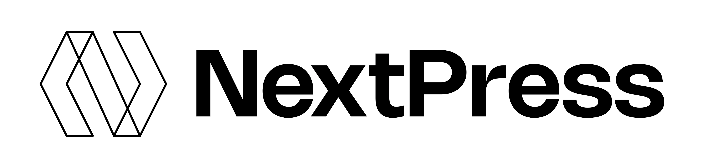

# NextPress Project



Welcome to the **NextPress Project**! 🎉 This is our ambitious open-source initiative to bring the power of WordPress into the JavaScript realm. We're on a mission to revolutionize web development, and we invite you to join us on this exciting journey. With NextPress, we're transforming the WordPress ecosystem into a JavaScript playground where plugins, themes, templates, and more can thrive.

## Table of Contents

- [Introduction](#introduction)
- [Roadmap](#roadmap)
- [Biggest Challenges](#biggest-challenges)
- [Features](#features)
- [Installation](#installation)
- [Project Structure](#project-structure)
- [Tracking Progress](#tracking-progress)
- [Contributing](#contributing)
- [License](#license)
- [Contact](#contact)

## Introduction

NextPress is not just another CMS in JavaScript. It's our vision for the future of open-source web development, reimagined in JS. By leveraging LLMs to translate WordPress files into JS, we're empowering developers with modern JavaScript frameworks while preserving the best aspects of the WordPress ecosystem.
This is not the translator! But the CMS files that we have been translated by either LLMs or humans.

## Roadmap

1. **H1 2025: Translate WP Core**: Translating the WordPress Core to create NextPress, a JavaScript-based version of WordPress.
2. **H2 2025: Develop Testing System**: Establish a robust testing system using Jest to ensure accurate translations.
3. **2026: Get the translator ready for Themes, Plugins, and Templates**: Enhance the translator to support converting WordPress themes, plugins, and templates into JavaScript.

## Biggest Challenges

- **File Structure**: Replicating WordPress file structures in NextPress and managing new file dependencies.
- **File Dependencies**: Handling inter-file dependencies within the translator.
- **LLM Limitations**: Overcoming token processing limits and ensuring seamless file chunking.

## Features

- **Comprehensive Translation**: Transform WordPress PHP files into JavaScript.
- **Page Rendering Agnostic**: Compatible with Next.js, React, and more.
- **Open Source**: Community-driven project for developers of all skill levels.
- **Scalable and Extensible**: Designed for large WordPress sites and custom needs.
- **Modern JavaScript Standards**: Follows AirBnB JavaScript style guide and ES6+ features.
- **Node.js Compatibility**: Compatible with Node.js v22.
- **JSDoc Comments**: Automatically adds JSDoc comments for better documentation.
- **ESM Modules**: Utilizes ECMAScript modules for imports.
- **Plugin and Theme Support**: Supports translation of plugins, themes, and templates.

## Installation

To get started with NextPress:

1. **Clone the Repository**:
   ```bash
   git clone https://github.com/yourusername/nextpress.git
   cd nextpress
   ```

2. **Install Dependencies**:
   ```bash
   npm install
   ```


## Project Structure

We prioritize replicating the WordPress file structure over what you would expect to see in a JS project.
Page rendering is defined in the theme, so whether you use Next.js, React, or any other framework, will be determined by the theme.

## Tracking Progress

All files should have a JSDoc comment at the top of the file. You can view the documentation [here] (https://pabloh3.github.io/nextpress/index.html)
WordPress core files are tracked in a SQLite database `project_files.db`, to know what has been translated, and what hasn't, with fields like:

- **uuid**: Unique ID.
- **file_path**: File location.
- **file_name**: Name without extension.
- **extension**: File extension.
- **description**: File description.
- **converted**: Translation status.
- **converted_date**: Date of translation.
- **converted_notes**: Translation notes.
- **dependencies**: File dependencies.
- **dependent_to**: Files dependent on this one.
- **created_at**: Database entry date.
- **updated_at**: Last update date.
- **resulting_file_paths**: Translated file locations.
- **package_dependencies**: Required NPM modules.

## Contributing

We welcome contributions! To get involved:

1. Fork the repository.
2. Create a new branch for your feature or bug fix.
3. Submit a pull request with a detailed description.

See our [Contributing Guidelines](CONTRIBUTING.md) for more details.

## License

This project is licensed under the GNU General Public License v2.0 or later. See the [LICENSE](LICENSE) file for details.

## Contact

Questions, suggestions, or just want to say hi? Reach out at [pablo@builditforme.ai](mailto:pablo@builditforme.ai).

Join our community on [WhatsApp](https://chat.whatsapp.com/JGzZL3YFi2VEhrULT3ib1a) and follow us on [Telegram](https://t.me/+ERdRxgHApi1kODBh) for updates!

---

Thank you for being part of the NextPress journey. Together, let's redefine the future of web development! 🚀
